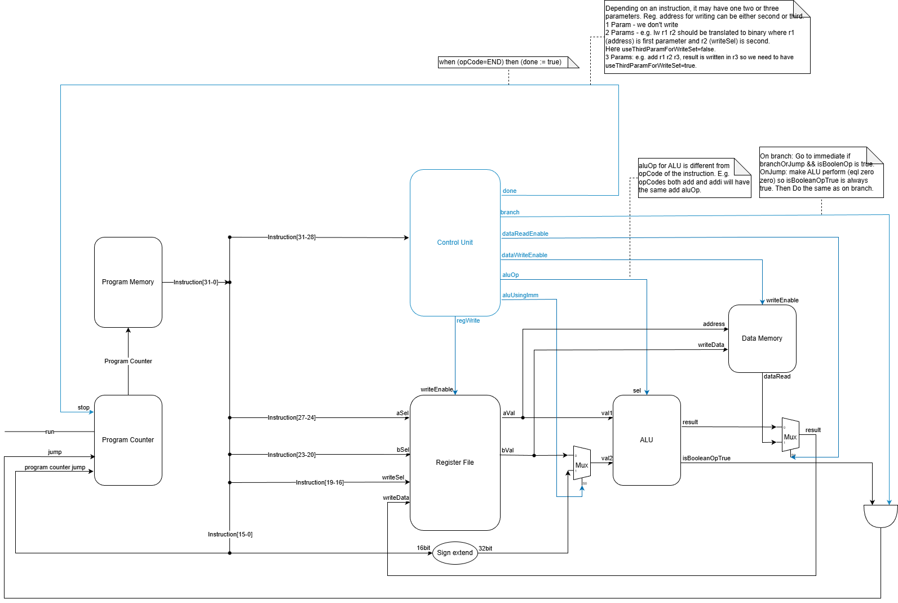

# Accelerated Computing Portfolio: CPU Architecture and Hardware Offloading

This project was developed as part of my Computer Systems course, where I implemented the same image-processing workload at different levels of abstraction.

Starting from a C implementation, I then built a simple single-cycle CPU in Chisel to execute the same logic, and finally designed a specialized accelerator for the task. The goal was to understand how computation maps from software to hardware, and what trade-offs appear at each level.

## Overview

The repository is organized as a progression:

1. A full C implementation of a cell-detection image-processing pipeline.
2. A single-cycle CPU in Chisel that executes a custom ISA program for the same task.
3. A custom accelerator in Chisel that directly implements the erosion logic.

## Key Takeaways

- Hardware/software co-design: the same workload implemented in software, on a CPU, and as a dedicated accelerator.
- Architecture fundamentals: control/datapath separation, ALU and control unit design, register file and memory integration.
- Memory reasoning: explicit memory layout and data movement between components.
- Verification: tests and simulation used to validate behavior across all parts.
- Implementation across multiple levels: C, Python, and Scala/Chisel.

---

### Part 1: C Implementation

Path: `Part1-C_implementation/`

An end-to-end C pipeline that reads microscope BMP images, detects cells, and marks detected centers.

Main ideas:
- Grayscale conversion.
- Gaussian background subtraction (`Step1.1GaussianBlur.c`).
- Hole-filling pass (`Step1.2Fill.c`).
- Binary thresholding (`Step2BinaryThreshold.c`).
- Iterative erosion + capture (`Step3Erode.c`, `Step4Capture.c`).
- Marking detected cells with red X overlays (`Step5MarkingCells.c`).

Primary entry points:
- `main.c`: production pipeline run.
- `TestsRunMain.c`: tests, property checks, expected-output checks, and performance measurements.

Data and outputs:
- Input samples are in `Part1-C_implementation/samples/` (`easy`, `medium`, `hard`, `impossible`).
- Intermediate/final outputs are written to `Part1-C_implementation/output_images/`.
- Example references are in `Part1-C_implementation/results_example/`.
- Test logs are written to `Part1-C_implementation/test_results.txt`.

### Part 2: Chisel Single-Cycle General CPU

Path: `Part2-Chisel-Single_cycle_general_CPU/`

A 32-bit single-cycle CPU written in Chisel with separate modules for:
- Program counter.
- Program memory and data memory.
- Register file.
- ALU.
- Control unit.
- Top-level integration (`CPUTop.scala`).

Architecture-oriented highlights:
- Modular decomposition of compute and control paths.
- Custom ISA decode and control signal generation.
- Data and program memory interfaces suitable for testbench-driven loading and inspection.
- Assembly-to-machine-code workflow via a custom assembler script.

Custom ISA includes:
- Arithmetic: `ADD`, `SUB`, `ADDI`, `MULI`.
- Memory: `SW`, `LW`.
- Branching: `BEQ`, `BNE`, `BGE`.
- Termination: `END`.

The CPU executes an assembly program (`customCompiler/A2_assembly.s`) that performs image erosion-style processing on a 20x20 binary image mapped in memory.

Tooling:
- `customCompiler/assembler.py` converts assembly to machine-code entries used by Scala test programs.
- `docs/CPU_diagramV1.3.drawio` documents the datapath/control architecture.

Single-cycle CPU diagram:



Meaning and significance:
- The diagram shows how one instruction flows through fetch, decode, execute, memory, and write-back in a single clock cycle.
- It separates control decisions (Control Unit) from datapath operations (Program Counter, Register File, ALU, Memories), which is a core computer-architecture design principle.
- It makes branch behavior explicit: branch enable from control is combined with the ALU comparison result to decide Program Counter redirection.
- It highlights memory-mapped processing: program memory serves instructions while data memory holds image pixels and processed outputs.
- It demonstrates modular hardware composition that is easy to verify in simulation and easy to specialize later into the Part 3 accelerator.

### Part 3: Chisel Custom CPU / Accelerator

Path: `Part3-Chisel-Custom_CPU/`

A more specialized architecture that removes general instruction execution and focuses directly on the target workload.

Key modules:
- `Accelerator.scala`: FSM-based dedicated erosion engine.
- `SystemTop.scala`: top-level integration of accelerator and data memory.

Acceleration-oriented highlights:
- FSM-controlled pipeline for deterministic processing.
- Sliding-window style row buffering and neighborhood checks.
- Dedicated edge handling and write-back strategy.
- Clear tradeoff study versus Part 2 (programmability vs specialization).

Behavior:
- Reads a 20x20 input image from memory addresses `0..399`.
- Writes processed output to addresses `400..799`.
- Uses dedicated states for initialization, streaming rows, neighborhood checks, output writes, and edge handling.

This part demonstrates the tradeoff between flexibility (general CPU) and simplicity/efficiency (domain-specific accelerator).

## Quick Start

### Prerequisites

- C compiler (GCC or compatible).
- Java (JDK 8+ recommended for Chisel/SBT workflows).
- SBT.
- Python 3 (for the Part 2 assembler script).

### Part 1: Build and Run (C)

From `Part1-C_implementation/`, compile and run either entry point.

Example (Windows + GCC):

```bash
gcc cbmp.c Step1GrayScale.c Step2BinaryThreshold.c Step3Erode.c Step4Capture.c Step5MarkingCells.c CellDetection.c Debug.c TestData.c TestDataGeneration.c Step1.1GaussianBlur.c Step1.2Fill.c main.c -o main.exe
```

Run:

```bash
main.exe samples/medium/5MEDIUM.bmp output_images/FinalOutput.bmp --debug --threshold 20
```

Useful flags:
- `--debug`
- `--generate_test_data`
- `--sigma <value>`
- `--threshold <0..255>`

To build tests instead of production, replace `main.c` in the compile command with `TestsRunMain.c`, then run `TestsRunMain.exe`.

### Part 2: Run Chisel CPU Simulation

From `Part2-Chisel-Single_cycle_general_CPU/`:

```bash
sbt test
```

Or run specific tests:

```bash
sbt "testOnly CPUTopTester"
sbt "testOnly ALUTester"
sbt "testOnly ControlUnitTester"
```

To regenerate machine code from assembly:

```bash
cd customCompiler
python assembler.py
```

Then copy/update the generated instruction array where needed in Scala tests/program definitions.

### Part 3: Run Accelerator Simulation

From `Part3-Chisel-Custom_CPU/`:

```bash
sbt test
```

Or:

```bash
sbt "testOnly SystemTopTester"
```

## Technical Takeaways

This repository demonstrates:
- Software-hardware co-design of the same image-processing concept.
- Progressive abstraction: C algorithm -> ISA program on CPU -> dedicated accelerator FSM.
- Verification mindset using automated tests in both C and Chisel.
- Practical datapath/control design, memory mapping, and finite-state machine implementation.

## Suggested Positioning on Resume/GitHub

If you are reviewing this repository for an accelerated-computing internship, the strongest evidence is:
- End-to-end implementation from algorithm to architecture.
- CPU microarchitecture implementation with a custom ISA and assembler support.
- Dedicated accelerator design that demonstrates hardware offloading principles.

## Notes

- Part 1 includes detailed internal documentation in `Part1-C_implementation/README.md`.
- Sample image sizes differ by part: real BMP pipeline in Part 1 versus compact 20x20 memory-mapped images in Parts 2 and 3 for faster simulation.
